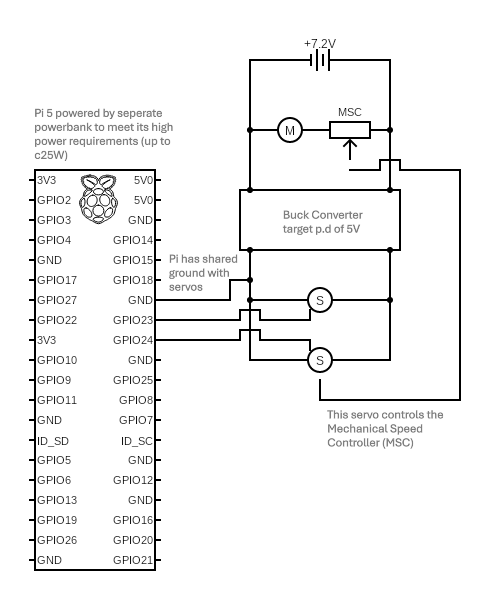

# LunaRover (Manual)
## Introduction

I have a dog named Luna. I sometimes feel bad when I leave Luna to entertain herself. I wanted a cool new project to work on. Considering all that, I present to you.... the LunaRover. This project, M25, is a precursor to the more advanced project, A25. Before I can make a vehicle automated I need to demonstrate I can make it work manually.

## Proposed solution
Brushed motor radio controlled (rc) car modified to drive autonomously with the help of a raspberry pi. You're probably wondedering... why on earth would you use a brushed motor rc car. Well... I got one for free!

## Method
### Step 1 - Figuring out how my rc car works and retrofitting my own circuitry

I was fortunate enough to be given an rc car for free by my uncle. What's great about the rc car that I got is that it is really easy to understand what is going on, and it meets my torque requirements!

So.... how does it work? A radio transponder sends out a signal to a transceiver (mine was an acoms transceiver). The transceiver then interprets the signal and sends a Pulse Width Modulated (PWM) signal to one of two servos. The first servo controls direction of the front wheels, the second servo controls a mechanical speed controller - which is sort of like a potentiometer for scaling output voltage to the brushed dc motor driving the rear wheels. It's important to note that there is a Battery Eliminator Circuit (BEC) in the acoms receiver which enables the 7.2V from the battery to be stepped down to within the operating voltage range for servo motors.

So, easy right.... well, a bit, but not entirely. My servo motor was a hand-me-down, so naturally I was missing the transponder to control the rc car. So, I had to control the car another way... in the end I opted for a raspberry pi 5 - as I know I'd end up using it for the image detection later on. I stripped out the receiver and modified the circuitry slightly so that it looked like the below:



### Step 2 - Uploading an operating system to the raspberry pi

Without an operating system you're going to have some problems using your raspberry pi.... so definitely don't skip this step. For this step you'll need a microsd card, someway to connect that microsd card to your computer, and [raspberry pi imager software](https://www.raspberrypi.com/software/). Make sure to go to settings and take note of your hostname, user, password, and ensure wi-fi credentials are correct! I had some issues with this step... hopefully you won't.

### Step 3 - Developing the firmware

Raspberry Pi 5's... just get a 4 and save yourself the hassle. Previously popular GPIO libraries can't be used on the Pi 5, which means you'll have to use another. I used the gpiod library to control my servos - as shown below. In the end I decided to operate my brushed DC motor for X time whenever the up-arrow was pressed, as the motor was far more powerful than I realised and I didn't want to convert that motor speed to more torque with additional gears.

I wrote this code after connecting to my raspberry pi using Secure Socket Shell (SSH) and using the "nano" command.

```

import gpiod
import time
import curses
import threading

# GPIO chip and pins (BCM numbering)
CHIP = 'gpiochip0'
SERVO1_PIN = 24  # Steering servo on GPIO 24
SERVO2_PIN = 23  # Speed servo on GPIO 23

# PWM period (50Hz = 20ms)
PERIOD = 0.02

# Pulse widths for Servo 1 (Steering) in seconds
SERVO1_LEFT = 0.0001   # Partly left (e.g., 60°)
SERVO1_CENTER = 0.009 # Central (e.g., 90°)
SERVO1_RIGHT = 0.0017  # Partly right (e.g., 120°)

# Pulse widths for Servo 2 (Speed Controller) in seconds
SERVO2_CENTRAL = 0.0013 # Central/stop (e.g., 90°)
SERVO2_PARTIAL = 0.0016 # Forward partial speed (e.g., 110°)
SERVO2_MAX = 0.002     # Forward maximum speed (e.g., 180°)
SERVO2_REVERSE = 0.0009 # Reverse partial speed (e.g., 70°)

def send_pwm_burst(chip, pin, pulse_width, duration, return_to_central=False, central_pulse=SERVO2_CENTRAL):
    """Send a burst of PWM signals to move the servo to the desired position."""
    line = chip.get_line(pin)
    line.request(consumer='servo', type=gpiod.LINE_REQ_DIR_OUT)
    start_time = time.time()
    while time.time() - start_time < duration:
        line.set_value(1)
        time.sleep(pulse_width)
        line.set_value(0)
        time.sleep(PERIOD - pulse_width)
    if return_to_central and pin == SERVO2_PIN:
        # Return Servo 2 to central position after duration
        start_time = time.time()
        while time.time() - start_time < duration:
            line.set_value(1)
            time.sleep(central_pulse)
            line.set_value(0)
            time.sleep(PERIOD - central_pulse)
    line.release()

def main(stdscr):
    # Initialize curses
    curses.cbreak()
    stdscr.keypad(True)
    stdscr.timeout(100)  # Non-blocking input with 100ms timeout
    stdscr.addstr(0, 0, "Servo Control Commands:")
    stdscr.addstr(1, 0, "- Servo 1 (Steering): '1 left', '1 center', '1 right'")
    stdscr.addstr(2, 0, "- Servo 2 (Speed): Up arrow (forward), Down arrow (reverse)")
    stdscr.addstr(3, 0, "- Quit: 'q'")
    stdscr.addstr(5, 0, "Enter command or use arrow keys: ")
    stdscr.refresh()

    chip = gpiod.Chip(CHIP)
    command = ""
    try:
        while True:
            try:
                # Check for key press (non-blocking)
                key = stdscr.getch()
                if key == curses.KEY_UP:
                    # Up arrow: Servo 2 forward (partial speed)
                    threading.Thread(target=send_pwm_burst, args=(chip, SERVO2_PIN, SERVO2_PARTIAL, 0.4, True)).start()
                    stdscr.addstr(6, 0, "Servo 2 set to partial speed (forward)  ")
                    stdscr.refresh()
                elif key == curses.KEY_DOWN:
                    # Down arrow: Servo 2 reverse
                    threading.Thread(target=send_pwm_burst, args=(chip, SERVO1_PIN, SERVO1_CENTER, 0.5, True)).start()
                    stdscr.addstr(6, 0, "Centering           ")
                    stdscr.refresh()
                elif key == curses.KEY_RIGHT:
                    threading.Thread(target=send_pwm_burst, args=(chip,SERVO1_PIN, SERVO1_RIGHT,0.5,False)).start()
                    stdscr.addstr(6 ,0, "Turning right           ")
                    stdscr.refresh()
                elif key == curses.KEY_LEFT:
                    threading.Thread(target=send_pwm_burst, args=(chip,SERVO1_PIN, SERVO1_LEFT,0.5,False)).start()
                    stdscr.addstr(6, 0, "Turning left             ")
 		    stdscr.refresh()
                elif key != -1:  # Other key pressed
                    char = chr(key).lower()
                    if char == 'q':
                        stdscr.addstr(6, 0, "Exiting...                            ")
                        stdscr.refresh()
                        break
                    elif char == '\n':
                        if command:
                            try:
                                servo, position = command.strip().split()
                                if servo == '1':
                                    if position == 'left':
                                        send_pwm_burst(chip, SERVO1_PIN, SERVO1_LEFT, 0.5, False)
                                        stdscr.addstr(6, 0, "Servo 1 set to partly left            ")
                                    elif position == 'center':
                                        send_pwm_burst(chip, SERVO1_PIN, SERVO1_CENTER, 0.5, False)
                                        stdscr.addstr(6, 0, "Servo 1 set to central                ")
                                    elif position == 'right':
                                        send_pwm_burst(chip, SERVO1_PIN, SERVO1_RIGHT, 0.5, False)
                                        stdscr.addstr(6, 0, "Servo 1 set to partly right           ")
                                    else:
                                        stdscr.addstr(6, 0, "Invalid position. Use 'left', 'center', or 'right' ")
                                elif servo == '2':
                                    if position == 'central':
                                        send_pwm_burst(chip, SERVO2_PIN, SERVO2_CENTRAL)
                                        stdscr.addstr(6, 0, "Servo 2 set to central (stop)         ")
                                    elif position == 'partial':
                                        threading.Thread(target=send_pwm_burst, args=(chip, SERVO2_PIN, SERVO2_PARTIAL, 0.4, True)).start()
                                        stdscr.addstr(6, 0, "Servo 2 set to partial speed (forward) ")
                                    elif position == 'max':
                                        threading.Thread(target=send_pwm_burst, args=(chip, SERVO2_PIN, SERVO2_MAX, 0.5, True)).start()
                                        stdscr.addstr(6, 0, "Servo 2 set to maximum speed (forward) ")
                                    else:
                                        stdscr.addstr(6, 0, "Invalid position. Use 'central', 'partial', or 'max' ")
                                else:
                                    stdscr.addstr(6, 0, "Invalid servo. Use '1' for steering or '2' for speed ")
                                stdscr.refresh()
                            except ValueError:
                                stdscr.addstr(6, 0, "Invalid format. Use '<servo> <position>', e.g., '1 left' ")
                                stdscr.refresh()
                            command = ""  # Reset command after processing
                    else:
                        command += char
                        stdscr.addstr(5, 30, command + " " * 20)
                        stdscr.refresh()
            except ValueError:
                stdscr.addstr(6, 0, "Invalid input detected                    ")
                stdscr.refresh()
    finally:
        chip.close()
        stdscr.addstr(6, 0, "GPIO resources released.                  ")
        stdscr.refresh()
        curses.nocbreak()
        stdscr.keypad(False)
        curses.echo()
        curses.endwin()

if __name__ == '__main__':
    curses.wrapper(main)


```

### Step 4 - Remotely operate with raspberry pi

SSH into the pi then run the code using python3 [file_name]. Forward to go forward, right to turn wheels right, left to turn, down to turn wheels to their central position. Alternatively you can control it using the servo number and the desired position (e.g 1 left, or 2 max).

## Project overview

### Main lesson learned

Don't try and make your own drivetrain using a 3D printer with terrible tolerances and a slow extrusion speed - not worth it.

### Next steps

Make the rover autonomous. See LunaRoverA25 project.
