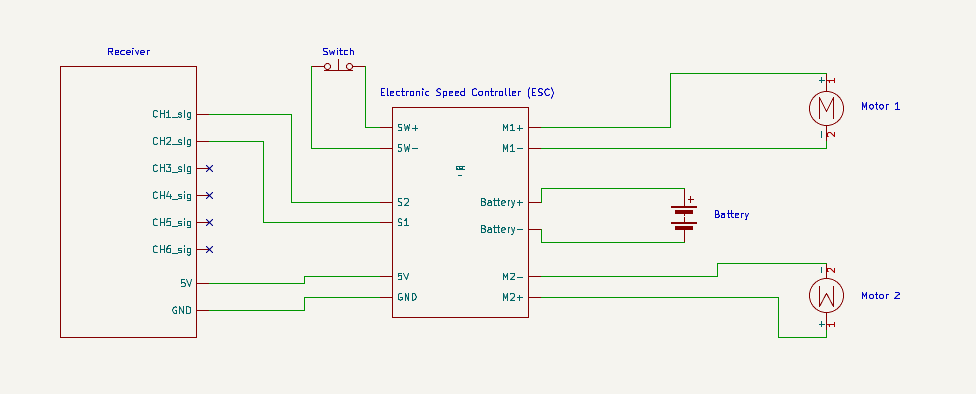

# LunaRoverM25-V3
LunaRoverM25 V2 had issues with a. high latency control, b. spagehetti wires. c. insufficient ground clearance. LunaRoverM25-V3 overcame each of those issues and produced a car with sufficient control and torque to drive around my garden! (see below)

https://github.com/user-attachments/assets/f207edc8-f391-4f31-bda7-1b76478d4eb3

## Updates from V2
### Battery
When testing V2 I was using a boost converter with a 7.2V NiMh battery. For V3 I tested it with a 11.1V (3S) lipo battery - which made a huge difference in my output power.

### Orientation
I noticed V2 was really close to the ground. A quick fix was to flip it upside down and mount the battery etc. on the top. This worked surpisingly well! Although, I still think more clearance would be ideal.

### Controls hardware / electronics setup
LunaRoverV3 addressed the high latency control and spaghetti control issues by redesigning the electronics. Previously, in V2, signals were communicated to the device using a cheap 433MHz transmitter-receiver set - which are constrained by how fast they can modulate and demodulate a signal (for example: in my case the receiver wouldn't receive signals transmitted every transmit cycle - leading to delay where it would have to wait for another transmission). To combat this, V3 uses a 2.4GHz transmitter-receiver set (the Flysky FS-i6X). However, another reason for high latency control  in V2 was that signals received were processed by a RPi 5 (using Python) - therefore incurring interpretation delay repreatedly during execution. To counter this I decided to ignore the RPi 5 for the time being and connect the 2.4Ghz receiver directly to an electronic speed controller (I'm using the Kingmodel 40AX2 - which is relatively cheap but which should be able to handle the peak stall current I anticipate from my 2 x brushed 775 motors). These changes have removed the requirement for 2 x motor driver, 2 x level shifters, and many cables connecting them to each other and to the RPi 5. The new electronics setup is shared below.

## Conclusion
Marked improvement on V2 as an RC car. Further work should focus in these areas:
* Increase ground clearance
* Improve traction (look into use of TPU tyres).
* Explore if worth adding dampers (to help maintain wheel contact with the ground at all times).
* Redesign chassis so that really easy to manufacture (e.g Alu sheet for base instead of complex 3D printed shapes).
* Replace drivetrain with planetary gears to reduce complexity.

## V3 images

