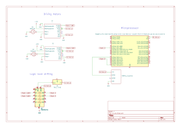

# LunaRoverM25-V3
LunaRoverM25 V2 had some issues with a. high latency control, b. spagehetti wires. c. insufficient ground clearance. LunaRoverM25-V3 overcome a. and b., but not c.

## Summary
LunaRoverV3 has addressed the high latency control and spaghetti control issues by redesigning the electronics. Previously, in V2, signals were communicated to the device using a cheap 433MHz transmitter-receiver set - which are constrained by how fast they can modulate and demodulate a signal (for example: in my case the receiver wouldn't receive signals transmitted every transmit cycle - leading to delay where it would have to wait for another transmission). To combat this, V3 uses a 2.4GHz transmitter-receiver set (the Flysky FS-i6X). However, another reason for high latency control  in V2 was that signals received were processed by a RPi 5 (using Python) - therefore incurring interpretation delay repreatedly during execution. To counter this I decided to ignore the RPi 5 for the time being and connect the 2.4Ghz receiver directly to an electronic speed controller (I'm using the Kingmodel 40AX2 - which is relatively cheap but which should be able to handle the peak stall current I anticipate from my 2 x brushed 775 motors). These changes have removed the requirement for 2 x motor driver, 2 x level shifters, and many cables connecting them to each other and to the RPi 5.

As tempting as it is to just buy a really great looking tracked vehicle which can carry a 10kg payload (fro AliExpress), I've thought of some quick ways in which I think I can improve the LunaRover - which are: flip it upside down for more clearance (will remount electronics), replace control mechanism with a 2.4GHz transmitter and ESC.

## Introduction
I have a dog named Luna. I sometimes feel bad when I leave Luna to entertain herself. I wanted a cool new project to work on. Considering all that, I present to you.... the LunaRover.

Although, to be honest, the longer this goes on the more I realise its for me (the fun of the journey) not for Luna.

## What already exists?
If I wanted to leave my dog in the garden to entertain herself, what products could I procure to achieve that? And how do those products compare to the real deal of me being with Luna? For example, I can give her a stick - which she will play with, but its nothing like the fun she has when I chase her around my garden. To get an understanding of that I thought it'd be useful to present a venn diagram with buckets for: how I currently entertain my dog, what autonomous systems exist, and what powered vehicles exist. The listed items within each bucket are by no means exhaustive, but inspire idea generation nonetheless.

It surprises me that I couldn't find evidence of someone having created an autonomous vehicle to play with their dog... that's something that I've sought to resolve. Note that, this version is manual but by implementing logic from the LunaRoverA25-V1 it can be converted to be automatic (I just haven't got around to that yet as the grass is to wet to test it on in the winter)

## Proposed solution
Create a radio controlled (rc) car which can drive autonomously at the flick of toggle. (this is just for the manual part though).

## Method
### Design new RC car, with a customisable drivetrain
#### Step 1 - Design the RC car
The premise for designing my own RC car from scratch was to address the two failure points alluded to above:
a. Not enough torque
b. Steering mechanism getting caught in long grass

Point "a" can be addressed by having a drivetrain where gear ratio can easily be adjusted, therefore enabling for RPM to be compensated for torque, or vice versa. Point "b" can be addressed by having a dual wheel drive (one motor attached to a wheel on each side), therefore cicumventing the need for a steering system.

#### Step 2 - Design the electronics

The circuit design allows for PWM signals to be sent from the raspberry pi to the brushed dc motors, via the motor drivers. To do that it is necessary that 3.3V logic signals from the raspberry pi are converted to 5V logic signals which can be interpreted by the BTS7960 motor driver. Different PWM signals are sent depending on the Radio Frequency (RF) data received.

## Conclusion
It works as an RC car, but its clear there are some areas of improvement. Notably:
* High latency in processing movement commands. I think this is due to a combination of the fact that I am a. using a RPi as a "middleman" to process received commands into PWM signals, b. using a 433 MHz tansmitter and receiver. To improve this I could use a 2.4GHz transmitter and receiver which sends signals directly to the speed controller (bypassing signals being sent to the RPi entirely and replacing the two enormous BTS7960 motor drivers with a single dual motor ESC).
* Drivetrain weight. Its heavyand takes up a lot of space. In hindsight planetary gears would've been more ideal. The fact that the gear ratio is configurable isn't very useful as a. its tedious to change the ratio, and b. I never change the ratio.
* Lawnmover wheels. They were free, and I love recycling, but they ice skate on my laminate wood flooring. Not a massive issue as intend on using the vehicle outside.
* Clearance between underneath of the body and the floor is minimal. This is an issue as the drag through long grass is a problem. If I were to redesign I'd have an axle run under the body (as they do in cars).
